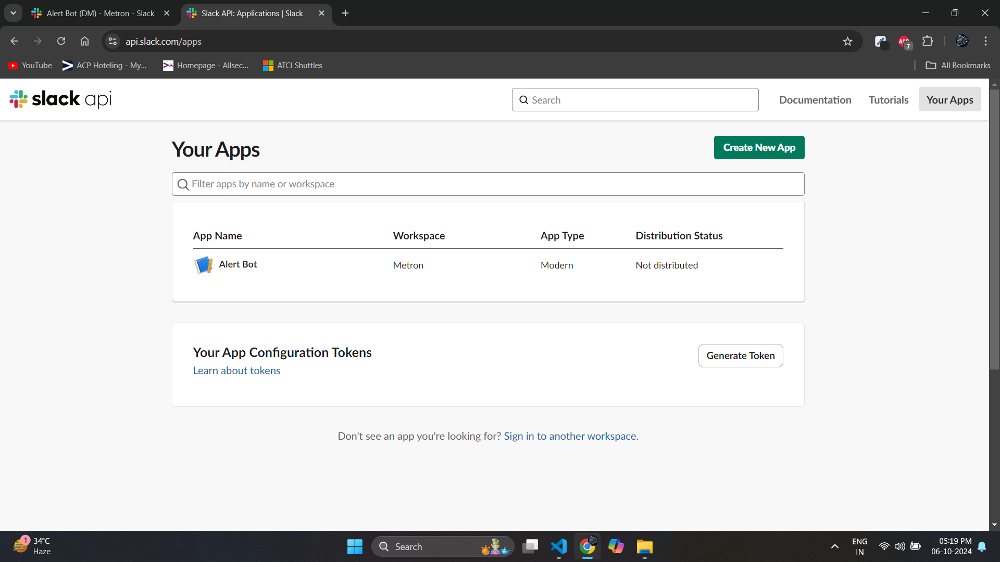
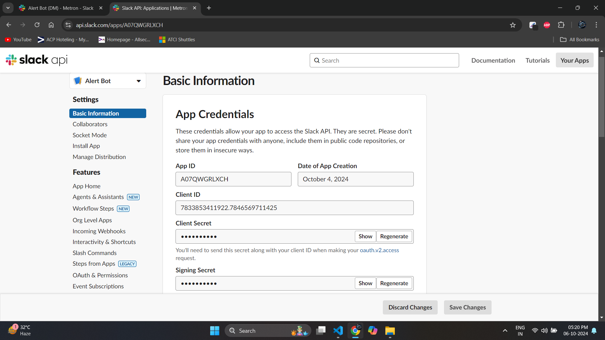
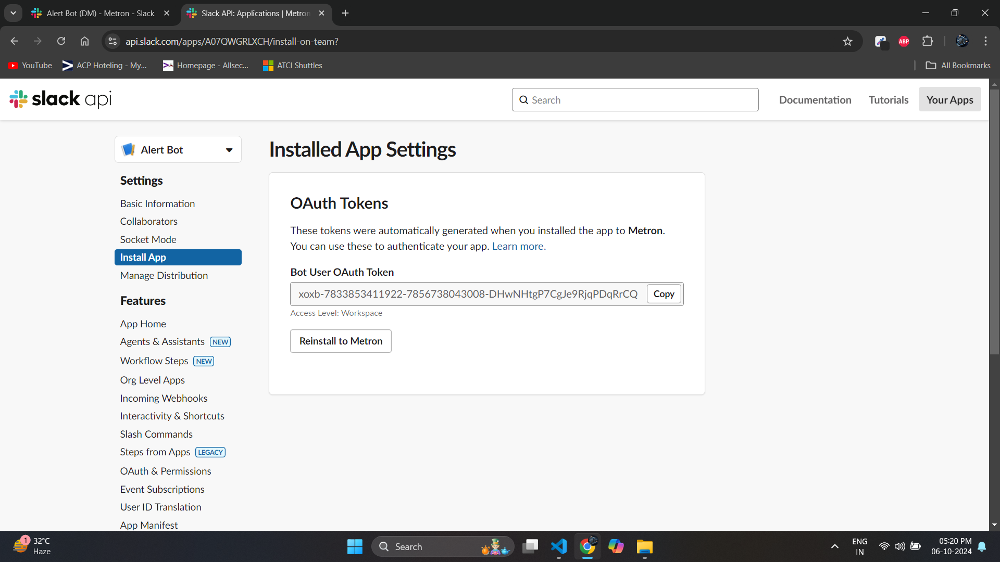
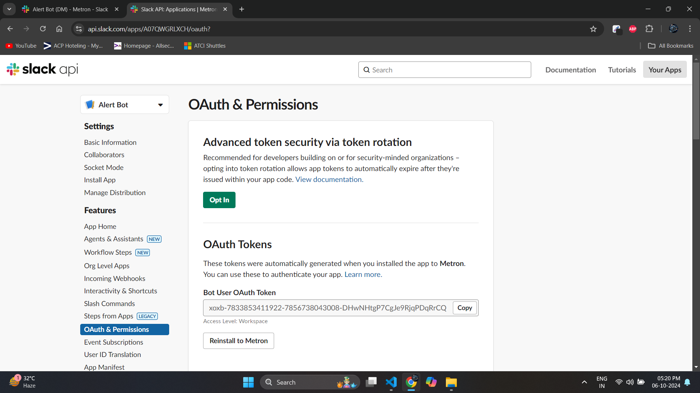
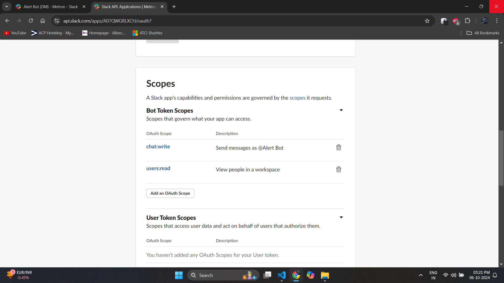
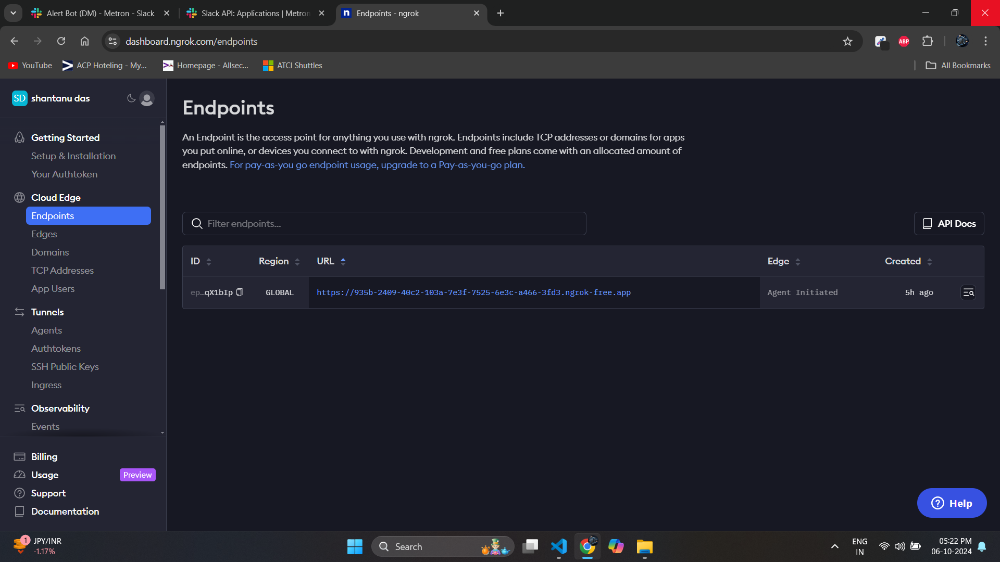
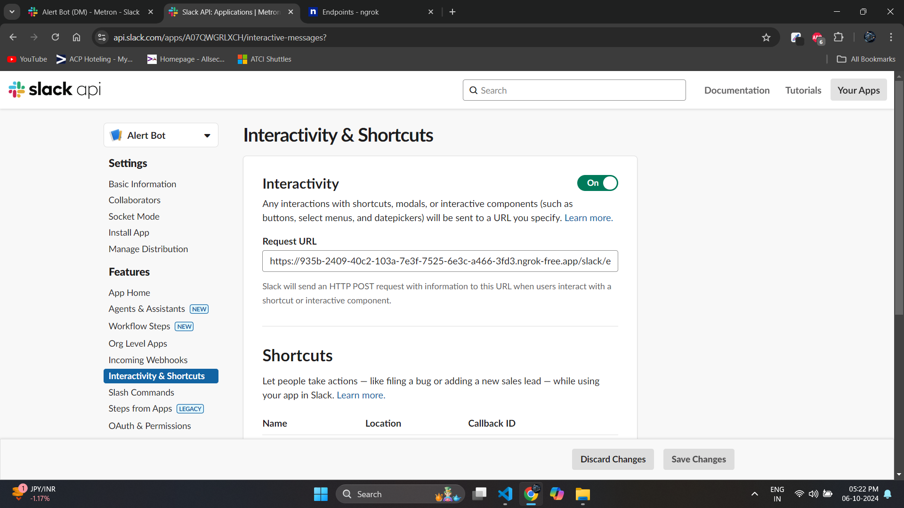

# Metron_Slack_app

Slack App to notify when new variabilities comes in NVD

For make this work please clone the repo and follow the below steps :-

1. **Clone** the repo.
2. Run **npm install**.
3. Create your Slack app on [Slack App](https://api.slack.com/).
4. Go to Your Apps at top right corner and **Create a new App**.
   
5. You will be given [basic info](https://api.slack.com/apps/A07QWGRLXCH/general?) about the app take the **Signing Secret** and add to the **secrets.json** file in the code which contains all the credentials.
   
6. Go to [install app](https://api.slack.com/apps/A07QWGRLXCH/install-on-team?) from the same page as previous from left side menu and install the bot and copy the **bot token** and add to **secrets.json** file in the code.
   
7. Under features you will find [OAuth & Permissions](https://api.slack.com/apps/A07QWGRLXCH/oauth?) there under scopes **Add an OAuth Scope > chat:write & users:read**.
8. Now get **user id** from your **slack profile** and add to **secrets.json** file in the code.
   
   
9. Run **ngrok http http://localhost:3000** and you will get a [URL](https://dashboard.ngrok.com/endpoints) which will be used in our Slack App .
   
10. Go back to the [Slack App Interactivity](https://api.slack.com/apps/A07QWGRLXCH/interactive-messages?) and paste the ngrok URL there by adding **/slack/events**
    
11. Start the App by running **npm start**.
12. You should be getting response.Ask your members to add the app if they are on the same workspace.
